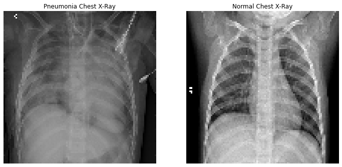
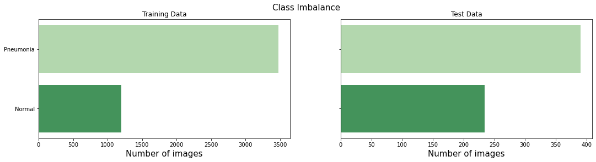
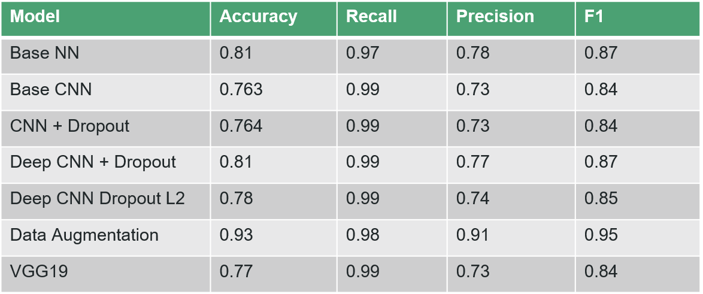
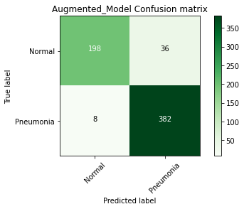

# Detecting Pneumonia With Deep Learning

The objective of this project is to create a model that can accurately detect pneumonia in patients when provided with an x-ray of their lungs.

The image below shows how difficult a task this can be, and it is clear to see how this could take a doctor a while to diagnose, can models see something a doctor cannot?

Why?

- Save radiologists time, save administration time for unnecessary appointments, time and spare patients from being misdiagnosed and being given anti-biotics they don't need (at their own expense).
- Rapidly diagnose pneumonia or rule it out giving patient best chance to fully recover.

## The Data

The data was downloaded from [kaggle](https://www.kaggle.com/paultimothymooney/chest-xray-pneumonia) and is already split into training, test and validation data.
There is clear class imbalance in the dataset, something which can make it difficult to attain a model with high precision.

- There are 5,863 images in this dataset
- The images are classified into two categories: 1. Pneumonia present 2. Pneumonia not present

## The Results

The table above shows the results for each model that was used in this project.
The results are using the hold out test data and where applicable refer only to the pneumonia class scores. 

## Final Model - CNN with Augmented Data

## Conclusions

The best model was the model that utilised augmentation to complement the existing training data set. 

On the hold out data the model achieved a high accuracy of 0.93

The recall and precision in the minority class (Normal) was also the highest achieved in any of the models. The recall of the PNEUMONIA class was not the best recorded at 0.98 vs 0.99 achieved in the other models. However these models had an unnacceptable recall in the Normal class, meaning many patients would go onto to be misdiagnosed with pneumonia.

As can be seen, still a very small number (8) was seen to be 'NORMAL' whilst actually suffering from pneumonia. For comparison the lowest this number got to in other models was 2, meaning the model of choice misses 6 people with pneumonia that other models didn't miss. 

This is an interesting choice therefore, why would I pick a model that misses more pneumonia?

The recall of the NORMAL class is vitally important too, and the difference between the best model in this metric (0.85) was so much higher than the next best (0.56). I see this as an unnacceptable number of people being diagnosed with Pneumonia that don't have it. This could potentially stop a patient being treated for the real underlying cause of their ailment and missing something more serious and or lead to perfectly healthy patients being treated for pneumonia that don't have it. This can waste valuable resources not only in terms of money on drugs, but also time of consultants etc.

## Further Work

- As with any project, more data the better. This dataset was relatively small at just 1000s of images. Ideally this would be in 10,000s or even 100,000s or into the millions. Of course this would then be beyond the limitations of my personal computer and would need to be cloud based

- Address the class imbalance to see if this has any impact on performance.

- Further tuning of the final model could be carried out in an attempt to increase performance.

- Due to time constraints, I only experimented with one pre-trained model, ideally I would expand this to the list below:
    - DenseNet
    - InceptionResNetV2
    - InceptionV3
    - MobileNet
    - NASNet
    - ResNet50
    - VGG16
    - Xception
